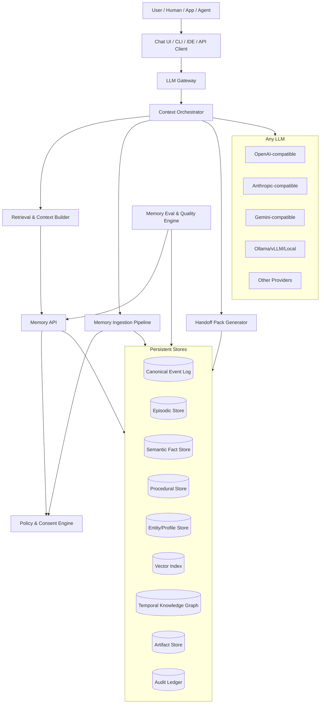
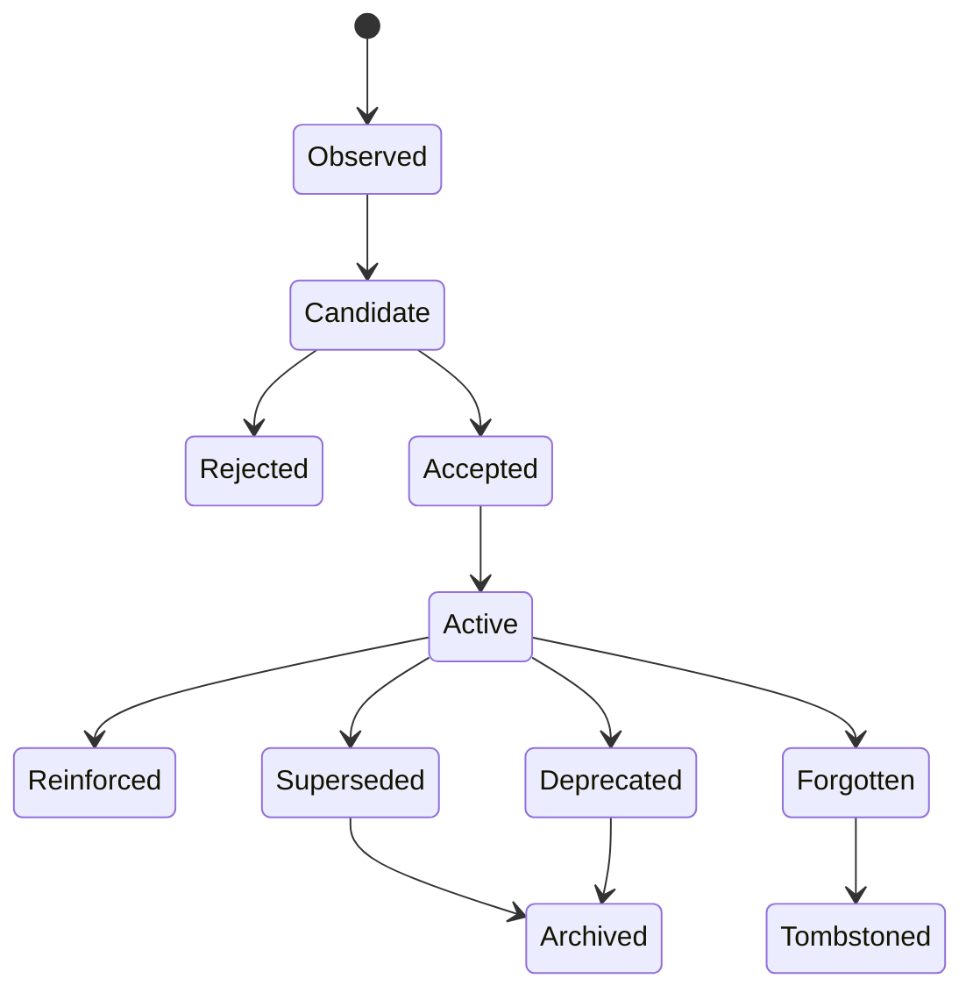
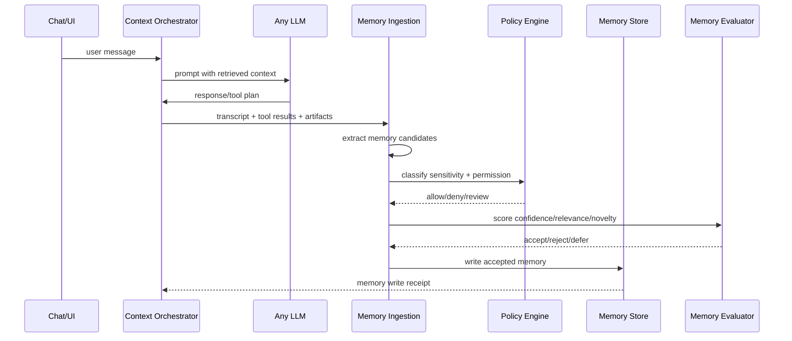

# Continuum-Memory: Idea

To behave intelligently, AI frameworks (like CoALA) rely on in-context (working), episodic, semantic, and procedural memory. These systems allow AI to store, process, and act upon distinct types of data. design and architect an all-inclusive system that can be used with any LLM to ensure that memory, context, etc. can survive end of chat session and handoffs to new chat sessions.

---

Below is a full architecture for a **model-agnostic persistent memory and context system** that can sit above **any LLM** and let memory survive the end of a chat, hand off cleanly to new chats, and support agentic workflows over time.

I would treat this as an **LLM Memory / Context Control Plane**, not merely a vector database or chat-history summarizer.

---

# 1. Core idea

An LLM by itself is stateless. It does not truly remember across calls unless memory is reintroduced through the prompt, tools, retrieval, or external state. CoALA frames language agents as systems with modular memory, internal/external actions, and a decision loop over those actions; it explicitly distinguishes short-term working memory from long-term episodic, semantic, and procedural memory. ([arXiv][1])

So the system should be:

> **A persistent, governed, model-agnostic memory operating system that captures everything important from interactions, converts it into durable memory objects, retrieves the right context later, and packages that context for any future model, chat, tool, agent, or human handoff.**

The central design principle:

> **Chats are disposable. Memory is durable. Context is assembled. Handoffs are explicit artifacts.**

---

# 2. Name the system

For clarity, I’ll call the system:

# **Continuum Memory Control Plane**

It can be renamed later, but the concept is:

```txt
Continuum = persistent identity + persistent memory + persistent context + persistent handoff state across ephemeral LLM sessions.
```

It is not one agent. It is infrastructure that any agent, assistant, CLI, IDE plugin, app, workflow engine, or chat UI can use.

---

# 3. What problem it solves

Normal chat systems fail because they treat the chat transcript as the source of truth.

That causes several problems:

| Problem              | Why it happens                                                                    |
| -------------------- | --------------------------------------------------------------------------------- |
| Memory loss          | Chat state is tied to one conversation thread.                                    |
| Context overload     | Full history eventually exceeds context windows.                                  |
| Bad summarization    | Summaries lose decisions, evidence, constraints, and rationale.                   |
| Handoff failure      | New chats lack task state, project state, open questions, and prior assumptions.  |
| Contradictory memory | Old facts and new facts coexist without versioning or supersession.               |
| Poor governance      | No audit trail of why something was remembered, retrieved, changed, or forgotten. |
| Model lock-in        | Memory format depends on one vendor’s assistant/thread system.                    |
| Unsafe recall        | Sensitive data may be remembered or retrieved when it should not be.              |

Continuum solves this by separating:

```txt
conversation ≠ memory
memory ≠ context
context ≠ prompt
prompt ≠ source of truth
```

---

# 4. Top-level architecture



The **LLM Gateway** abstracts over model providers. The **Context Orchestrator** decides what context to assemble. The **Memory API** reads/writes durable memory. The **Policy Engine** decides what may be stored, retrieved, or forgotten. The **Handoff Pack Generator** creates portable artifacts that allow a new chat/session/model to resume work.

---

# 5. Memory taxonomy

The system should support at least these memory classes.

## 5.1 Working memory

**Purpose:** Active state for the current turn, run, or task.

Examples:

```txt
current user request
current goal
active task plan
retrieved memories
tool results
open assumptions
scratch variables
current reasoning state summary
```

This is not long-term memory. It is the temporary context assembled for one run.

Modern frameworks such as LangGraph distinguish thread-scoped short-term memory from cross-session long-term memory stored in custom namespaces. ([LangChain Docs][2])

Recommended implementation:

```txt
Store: Redis / Dragonfly / Valkey for active run state
Durable checkpoint: PostgreSQL
Scope: run_id, session_id, thread_id, task_id
TTL: short by default, checkpointed when valuable
```

---

## 5.2 Episodic memory

**Purpose:** What happened.

Examples:

```txt
User asked X.
Assistant recommended Y.
The user accepted recommendation Z.
Tool A was called with input B.
The command failed with error C.
Decision D was made at time T.
File F was generated.
```

Episodic memory should be **append-only** and evidence-rich.

Recommended implementation:

```txt
Canonical: PostgreSQL event log
Search: vector index over episode summaries
Graph: temporal links between episodes, users, projects, files, decisions
Retention: configurable
```

Episodic memory should answer:

```txt
What happened?
When did it happen?
Who or what caused it?
What evidence supports it?
What was the state before and after?
```

---

## 5.3 Semantic memory

**Purpose:** Durable facts, preferences, definitions, domain knowledge, and stable user/project/company context.

Examples:

```txt
User prefers Bun over npm.
Project A uses PostgreSQL.
The canonical branch strategy is trunk-based development.
The user accepted ADR-0004.
The company target ICP is mid-market engineering orgs.
```

Semantic memory should not be a pile of summaries. It should be structured, versioned, attributable knowledge.

Recommended implementation:

```txt
Canonical: PostgreSQL fact table
Embeddings: pgvector or Qdrant
Graph: entity-relation model
Format: subject, predicate, object, qualifier, evidence, confidence, validity window
```

A semantic memory should look like:

```json
{
  "id": "mem_sem_01HY...",
  "subject": "user",
  "predicate": "prefers_package_manager",
  "object": "bun",
  "scope": "software_projects",
  "confidence": 0.94,
  "source_episode_ids": ["evt_123", "evt_456"],
  "valid_from": "2026-06-27T00:00:00Z",
  "valid_to": null,
  "supersedes": null,
  "sensitivity": "normal",
  "write_policy": "requires_evidence",
  "retrieval_policy": "allowed_for_software_context"
}
```

---

## 5.4 Procedural memory

**Purpose:** How to do things.

Examples:

```txt
How to bootstrap this monorepo.
How to generate a handoff pack.
How to respond to the user’s preferred copy-paste workflow.
How to run project verification.
How to escalate from draft to implementation.
How to format ADRs.
```

Procedural memory is especially important for agents because it stores workflows, skills, scripts, policies, playbooks, prompt templates, and reusable operating procedures.

Recommended implementation:

```txt
Canonical: Git repository + database registry
Artifacts: Markdown, YAML, JSON Schema, scripts, templates
Versioning: semantic versions + changelog
Execution: tool broker / workflow engine
```

Procedural memory can include:

```txt
prompt templates
agent instructions
tool-use policies
CLI recipes
runbooks
scripts
checklists
decision procedures
validation gates
```

This is where the system remembers **how work should be done**, not just what was said.

---

## 5.5 Identity/profile memory

This is a special subtype of semantic memory.

**Purpose:** Persistent model of users, organizations, projects, agents, systems, and relationships.

Examples:

```txt
User profile
Company profile
Project profile
Repository profile
Agent profile
Tool profile
Data source profile
```

A project profile might include:

```json
{
  "project_id": "proj_monad",
  "name": "Monad",
  "type": "polyglot monorepo runtime",
  "preferred_language": "Rust",
  "package_manager": "Bun",
  "architecture": ["control-plane", "governance-grade", "local-first"],
  "active_decisions": ["ADR-0001", "ADR-0002"],
  "open_work": ["WP-E0-002", "WP-E1-001"]
}
```

---

## 5.6 Artifact memory

**Purpose:** Files, generated outputs, code, documents, PDFs, diagrams, datasets, and attachments.

Examples:

```txt
generated zip files
markdown tutorials
source files
screenshots
PDFs
handoff documents
architecture diagrams
logs
reports
```

Recommended implementation:

```txt
Metadata: PostgreSQL
Blob/object storage: S3-compatible MinIO locally, S3/R2 later
Embeddings: per chunk where appropriate
Line-level citation support: required
Checksums: required
```

Artifact memory should preserve:

```txt
file path
checksum
version
creator
source run
related task
related decisions
content index
permission policy
```

---

## 5.7 Decision memory

This deserves its own first-class model.

**Purpose:** Durable record of decisions, alternatives, rationale, consequences, and reversibility.

Examples:

```txt
Use PostgreSQL as canonical memory store.
Use Qdrant as optional retrieval accelerator.
Use OPA for policy.
Use local-first MVP.
Do not bind memory to one LLM vendor.
```

Decision memory should be ADR-like:

```json
{
  "decision_id": "dec_0007",
  "title": "Use PostgreSQL as canonical memory store",
  "status": "accepted",
  "context": "...",
  "decision": "...",
  "alternatives": ["MongoDB", "Neo4j-only", "vector-db-only"],
  "rationale": "...",
  "consequences": ["strong auditability", "simple local dev", "requires schema discipline"],
  "reversibility": "medium",
  "evidence": ["evt_123", "doc_456"],
  "decided_at": "2026-06-27T..."
}
```

This prevents the system from “remembering” only conclusions while forgetting why those conclusions were chosen.

---

## 5.8 Handoff memory

**Purpose:** Portable state package for resuming work in another chat, agent, model, environment, or human team.

This is the key to surviving session boundaries.

A handoff pack should include:

```txt
who/what this handoff is for
current objective
current state
important memories
accepted decisions
constraints
open questions
blockers
last known files/artifacts
commands already run
commands to run next
verification status
risks
recommended next action
```

Handoff memory is generated from the other memory stores.

It should be available as:

```txt
Markdown
JSON
YAML
LLM prompt block
Git-tracked file
API object
downloadable artifact
```

---

# 6. The five-layer memory model

I would implement the system as five layers.

```txt
Layer 1: Raw Events
Layer 2: Episodes
Layer 3: Consolidated Knowledge
Layer 4: Context Products
Layer 5: Governance / Evaluation
```

## Layer 1 — Raw events

Every interaction becomes an immutable event.

Examples:

```txt
message.received
message.sent
tool.called
tool.result
file.created
memory.candidate_detected
memory.written
memory.retrieved
decision.accepted
handoff.generated
policy.denied
```

This is the audit backbone.

---

## Layer 2 — Episodes

Raw events are grouped into episodes.

Examples:

```txt
one chat turn
one tool call sequence
one task attempt
one debugging session
one design session
one implementation run
```

Episodes preserve temporal and causal context.

---

## Layer 3 — Consolidated knowledge

The system promotes important episodes into durable facts, preferences, procedures, decisions, and project state.

This is where:

```txt
conversation → memory candidates → reviewed/accepted memory → versioned knowledge
```

happens.

---

## Layer 4 — Context products

The system turns memory into usable context.

Examples:

```txt
next prompt context
handoff summary
project briefing
task resumption pack
agent startup state
retrieval bundle
developer instruction block
risk summary
decision digest
```

This layer prevents raw memory from being dumped into prompts.

---

## Layer 5 — Governance and evaluation

The system continuously asks:

```txt
Should this be remembered?
Is it true?
Is it still current?
Is it sensitive?
Can it be retrieved for this user/task/model?
Did it help?
Did it hallucinate?
Should it be forgotten?
```

---

# 7. Storage architecture

Use multiple stores, but only one canonical source of truth.

## Recommended local-first stack

```txt
PostgreSQL          canonical memory, events, entities, decisions
pgvector            simple local vector search
Qdrant              optional high-performance vector retrieval
Neo4j / Kuzu        optional graph memory
MinIO               local artifact/blob storage
Redis/Valkey        working memory and run state
OpenTelemetry       traces
OPA/Rego            policy-as-code
Git                 procedural memory, ADRs, prompts, runbooks
```

Given your preferences, I would make **PostgreSQL the canonical brain**, with pgvector built in first, and Qdrant optional later. This matches a local-first, cloud-agnostic, governance-grade architecture.

The rule should be:

> Vector stores are indexes, not the source of truth.

---

# 8. Canonical data model

At minimum, the system needs these entities.

```txt
User
Organization
Project
Conversation
Session
Run
Turn
Message
ToolCall
Artifact
MemoryCandidate
MemoryRecord
Episode
SemanticFact
Procedure
Decision
HandoffPack
PolicyDecision
Evidence
Evaluation
```

## Core tables

```txt
users
organizations
projects
agents
sessions
conversations
runs
turns
messages
tool_calls
artifacts
events
episodes
memory_candidates
memory_records
semantic_facts
procedural_memories
decisions
handoff_packs
retrieval_requests
retrieval_results
policy_decisions
memory_evaluations
```

## Event table

```sql
create table memory_events (
  id uuid primary key,
  event_type text not null,
  actor_type text not null,
  actor_id text,
  subject_type text,
  subject_id text,
  project_id uuid,
  conversation_id uuid,
  session_id uuid,
  run_id uuid,
  payload jsonb not null,
  occurred_at timestamptz not null default now(),
  causation_id uuid,
  correlation_id uuid,
  checksum text,
  immutable boolean not null default true
);
```

## Memory record table

```sql
create table memory_records (
  id uuid primary key,
  memory_type text not null,
  namespace text not null,
  scope jsonb not null,
  content text not null,
  structured_content jsonb,
  source_event_ids uuid[] not null,
  source_artifact_ids uuid[],
  confidence numeric not null default 0.5,
  sensitivity text not null default 'normal',
  status text not null default 'active',
  valid_from timestamptz,
  valid_to timestamptz,
  supersedes uuid,
  superseded_by uuid,
  created_at timestamptz not null default now(),
  updated_at timestamptz not null default now()
);
```

## Semantic fact table

```sql
create table semantic_facts (
  id uuid primary key,
  subject text not null,
  predicate text not null,
  object text not null,
  qualifiers jsonb,
  namespace text not null,
  confidence numeric not null,
  evidence_ids uuid[] not null,
  valid_from timestamptz,
  valid_to timestamptz,
  supersedes uuid,
  status text not null default 'active',
  created_at timestamptz not null default now()
);
```

---

# 9. Memory lifecycle

Every memory should move through a lifecycle.



## Lifecycle stages

| Stage      | Meaning                                                              |
| ---------- | -------------------------------------------------------------------- |
| Observed   | Something happened in a message, tool call, file, or event.          |
| Candidate  | The system thinks it may be worth remembering.                       |
| Accepted   | It passed policy, quality, and relevance checks.                     |
| Active     | It can be retrieved.                                                 |
| Reinforced | Additional evidence supports it.                                     |
| Superseded | A newer memory replaced it.                                          |
| Deprecated | It may be stale or no longer recommended.                            |
| Forgotten  | User/system policy removed it from active recall.                    |
| Tombstoned | A deletion marker remains for audit/safety without exposing content. |

---

# 10. Write path: how memory is created

The write path should be conservative. Do not remember everything.



## Memory candidate extraction

After each turn or task, run extraction.

Candidate types:

```txt
preference
constraint
project fact
decision
task state
artifact reference
procedure
bug/error
risk
open question
identity/profile update
domain concept
```

Example extraction output:

```json
{
  "candidates": [
    {
      "type": "preference",
      "content": "User prefers copy-paste-ready terminal instructions with explanatory notes.",
      "scope": "software_build_workflows",
      "evidence": ["message_abc123"],
      "confidence": 0.96,
      "sensitivity": "normal",
      "recommended_action": "store"
    },
    {
      "type": "task_state",
      "content": "The current architecture task is designing an LLM-agnostic persistent memory control plane.",
      "scope": "current_project",
      "evidence": ["message_def456"],
      "confidence": 0.99,
      "sensitivity": "normal",
      "recommended_action": "store_until_superseded"
    }
  ]
}
```

---

# 11. Read path: how context is assembled

The read path should be intentional.

Do not retrieve “similar chunks” only. Retrieve by purpose.


## Context plan

Before retrieval, generate a context plan:

```json
{
  "request_type": "architecture_design",
  "needed_context": [
    "user_preferences",
    "project_governance_preferences",
    "accepted_prior_decisions",
    "relevant_procedures",
    "recent_task_state"
  ],
  "excluded_context": [
    "unrelated personal facts",
    "stale temporary task notes",
    "sensitive unrelated data"
  ],
  "retrieval_depth": "medium",
  "evidence_required": true
}
```

## Retrieval methods

Use hybrid retrieval:

```txt
keyword search
semantic vector search
graph traversal
time-based retrieval
entity/profile lookup
decision lookup
artifact lookup
procedure lookup
recency ranking
confidence ranking
policy filtering
```

This avoids over-relying on vector similarity.

Zep’s published architecture is notable because it uses a temporal knowledge graph, Graphiti, to synthesize conversational and business data while maintaining historical relationships; the larger point is that temporal graph structure matters for cross-session memory. ([arXiv][3])

---

# 12. Context assembly

The output of retrieval should not be dumped raw into the prompt.

It should be assembled into a structured **Context Pack**.

```json
{
  "context_pack_id": "ctx_01HY...",
  "for_model": "any",
  "for_task": "design_memory_system",
  "sections": {
    "identity": [],
    "project_state": [],
    "relevant_preferences": [],
    "accepted_decisions": [],
    "procedures": [],
    "recent_episodes": [],
    "open_questions": [],
    "constraints": [],
    "artifacts": []
  },
  "citations": [],
  "token_budget": {
    "max_tokens": 12000,
    "used_tokens": 7200
  }
}
```

The prompt should look like:

```txt
SYSTEM:
You are assisting with a continuing project. Use the provided context as durable memory.
Do not treat missing memory as proof that something never happened.
Respect all policy and sensitivity rules.

CURRENT TASK:
...

DURABLE CONTEXT:
1. User preferences
2. Project state
3. Accepted decisions
4. Relevant procedures
5. Recent episodes
6. Open questions
7. Evidence references

USER MESSAGE:
...
```

---

# 13. Handoff system

This is the most important feature for surviving chat boundaries.

## Handoff pack structure

Every serious session should be able to emit:

```txt
handoff.md
handoff.json
context-pack.json
memory-delta.json
decision-log.md
task-state.md
artifact-index.json
next-actions.md
verification.md
```

## Human-readable handoff

```md
# Handoff Pack

## Objective
Design and implement a model-agnostic persistent memory/control-plane system.

## Current State
The architecture has defined working, episodic, semantic, procedural, decision, artifact, and handoff memory.

## Accepted Decisions
- Use PostgreSQL as canonical store.
- Use vector DBs as indexes, not source of truth.
- Use explicit handoff packs for chat/session transfer.
- Make memory model-agnostic and provider-neutral.

## User Preferences
- User prefers comprehensive, copy-paste-ready, governance-grade instructions.
- User prefers local-first systems with cloud-native capability.
- User prefers auditability and explicit rationale.

## Open Questions
- What should the first MVP target be: CLI, web UI, API service, or integrated agent runtime?
- Should memory writes require user approval by default?

## Next Recommended Action
Create the repository scaffold and define schemas, API contracts, and the first memory ingestion pipeline.
```

## Machine-readable handoff

```json
{
  "handoff_id": "handoff_01HY...",
  "created_at": "2026-06-27T...",
  "objective": "Design LLM-agnostic persistent memory control plane",
  "state": {
    "phase": "architecture",
    "status": "ready_for_mvp_design"
  },
  "active_constraints": [
    "model-agnostic",
    "local-first",
    "audit-friendly",
    "memory survives chat boundaries"
  ],
  "accepted_decisions": ["dec_001", "dec_002"],
  "relevant_memory_ids": ["mem_001", "mem_002"],
  "next_actions": [
    "Define domain model",
    "Create API schema",
    "Implement event log",
    "Implement memory candidate extraction"
  ]
}
```

---

# 14. Any-LLM compatibility layer

To support any LLM, the system needs a provider abstraction.

```ts
interface LlmProvider {
  name: string
  capabilities: {
    chat: boolean
    tools: boolean
    jsonMode: boolean
    vision: boolean
    embeddings: boolean
    streaming: boolean
    contextWindow: number
  }

  complete(input: LlmRequest): Promise<LlmResponse>
  embed?(input: EmbeddingRequest): Promise<EmbeddingResponse>
}
```

Supported providers:

```txt
OpenAI-compatible APIs
Anthropic
Google Gemini
Mistral
Groq
Cohere
Ollama
vLLM
LM Studio
OpenRouter
local llama.cpp adapters
```

The memory system should never depend on a provider’s native thread/memory feature. Provider-native threads can be used as caches or convenience layers, but not as source of truth.

---

# 15. API design

## Core Memory API

```http
POST /v1/events
POST /v1/memory/candidates
POST /v1/memory
GET  /v1/memory/{id}
POST /v1/memory/search
POST /v1/context/build
POST /v1/handoffs
GET  /v1/handoffs/{id}
POST /v1/decisions
POST /v1/procedures
POST /v1/artifacts
POST /v1/evaluations
```

## Example: write memory

```http
POST /v1/memory
Content-Type: application/json
```

```json
{
  "memory_type": "semantic",
  "namespace": "user:default/software",
  "content": "User prefers Bun for JavaScript/TypeScript projects.",
  "structured_content": {
    "subject": "user",
    "predicate": "prefers_tool",
    "object": "Bun",
    "scope": "typescript_projects"
  },
  "source_event_ids": ["evt_123"],
  "confidence": 0.95
}
```

## Example: build context

```http
POST /v1/context/build
Content-Type: application/json
```

```json
{
  "user_id": "user_123",
  "project_id": "proj_456",
  "task": "continue architecture design",
  "model": {
    "provider": "openai-compatible",
    "context_window": 128000
  },
  "budget": {
    "max_input_tokens": 12000
  },
  "include": [
    "user_preferences",
    "project_state",
    "decisions",
    "procedures",
    "recent_episodes",
    "open_tasks"
  ]
}
```

---

# 16. Memory governance

A real memory system needs governance from day one.

## Required policies

```txt
consent policy
write policy
retrieval policy
sensitivity policy
retention policy
forgetting policy
project-boundary policy
tenant-boundary policy
model-provider policy
tool-access policy
audit policy
```

## Example policy questions

Before writing memory:

```txt
Did the user explicitly ask this to be remembered?
Is it useful beyond the current session?
Is it sensitive?
Is it inferred or directly stated?
Does it need confirmation?
Does it conflict with existing memory?
Should it expire?
```

Before retrieving memory:

```txt
Is this memory relevant to the current task?
Is the current actor allowed to access it?
Is it too sensitive for this model/provider?
Is it stale or superseded?
Would including it create privacy leakage?
```

---

# 17. Contradiction and supersession handling

The system must not simply append facts forever.

Example:

```txt
Old memory:
User prefers Next.js by default.

New memory:
User prefers TanStack Start with SolidJS by default, Next.js only when necessary.
```

The new memory should not merely coexist with the old one. It should supersede it.

```json
{
  "new_memory": "User prefers TanStack Start with SolidJS by default, Next.js only when necessary.",
  "supersedes": "mem_old_nextjs_default",
  "reason": "User later clarified default framework preference.",
  "status_change": {
    "mem_old_nextjs_default": "superseded"
  }
}
```

This is one of the biggest differences between a serious memory system and a simple RAG store.

---

# 18. Context quality controls

The system should score every retrieved context item.

## Retrieval score dimensions

```txt
semantic relevance
keyword relevance
recency
authority
confidence
evidence quality
scope match
task match
user/project match
non-superseded status
sensitivity compatibility
```

## Context inclusion rules

A memory should be included only when:

```txt
it is relevant
it is allowed
it is not superseded
it fits the token budget
it improves task performance
it has enough evidence
```

---

# 19. Evaluation system

Memory can make agents better, but it can also make them worse by retrieving stale, irrelevant, or false context. Current research on agent memory emphasizes the write-manage-read loop, contradiction handling, latency budgets, privacy governance, and the shift from static recall toward multi-session agentic evaluation. ([arXiv][4])

Continuum should evaluate:

```txt
Did the system remember the right things?
Did it forget the right things?
Did it retrieve useful context?
Did it avoid irrelevant context?
Did it preserve decisions?
Did it preserve user constraints?
Did it reduce repeated explanations?
Did it improve task success?
Did it introduce false memories?
```

## Metrics

```txt
memory precision
memory recall
false memory rate
supersession accuracy
retrieval relevance
context token efficiency
handoff completeness
task resumption success
decision preservation rate
stale memory inclusion rate
privacy violation rate
```

---

# 20. Procedural memory as executable skills

Procedural memory should not only be text.

It should include executable skill definitions.

```yaml
id: proc_generate_handoff_pack
name: Generate Handoff Pack
version: 1.0.0
description: Create a portable handoff package for continuing work in a new chat/session/model.
inputs:
  - user_id
  - project_id
  - conversation_id
  - task_id
steps:
  - collect_current_objective
  - retrieve_recent_episodes
  - retrieve_active_decisions
  - retrieve_open_tasks
  - retrieve_artifacts
  - summarize_state
  - generate_markdown
  - generate_json
  - store_handoff
outputs:
  - handoff_md
  - handoff_json
policies:
  - require_evidence
  - exclude_sensitive_unrelated_memory
```

This turns memory into reusable operating capability.

---

# 21. Repository architecture

A governance-grade monorepo for this system could look like this:

```txt
continuum-memory/
├── apps/
│   ├── api/                         # Memory/control-plane API
│   ├── web/                         # Admin UI / memory browser
│   ├── cli/                         # continuum CLI
│   └── playground/                  # Test chat UI
├── services/
│   ├── memory-ingestion/            # Candidate extraction and consolidation
│   ├── context-orchestrator/        # Context planning and prompt assembly
│   ├── retrieval-service/           # Hybrid retrieval
│   ├── policy-service/              # OPA/Rego wrapper
│   ├── handoff-service/             # Handoff pack generation
│   ├── eval-service/                # Memory quality evaluation
│   └── llm-gateway/                 # Provider abstraction
├── packages/
│   ├── domain/                      # Core domain models
│   ├── schemas/                     # JSON Schema / OpenAPI / AsyncAPI
│   ├── sdk-js/                      # TypeScript SDK
│   ├── sdk-python/                  # Python SDK
│   ├── prompt-contracts/            # Prompt templates and output schemas
│   └── policy-contracts/            # Policy interfaces
├── crates/
│   └── continuum-cli/               # Optional Rust CLI
├── infra/
│   ├── docker/
│   ├── migrations/
│   ├── terraform/
│   └── helm/
├── policies/
│   ├── memory-write.rego
│   ├── memory-read.rego
│   ├── retention.rego
│   └── provider-routing.rego
├── docs/
│   ├── architecture/
│   ├── adr/
│   ├── concepts/
│   ├── api/
│   ├── runbooks/
│   └── handoffs/
├── evals/
│   ├── datasets/
│   ├── scenarios/
│   └── reports/
├── prompts/
│   ├── extraction/
│   ├── consolidation/
│   ├── retrieval/
│   ├── handoff/
│   └── evaluation/
├── tests/
│   ├── unit/
│   ├── integration/
│   ├── e2e/
│   └── memory-regression/
└── README.md
```

---

# 22. Recommended service boundaries

For v1, I would not over-microservice it. I would start modular-monolith first.

## MVP modular services

```txt
api
memory-ingestion
context-orchestrator
retrieval
handoff
policy
```

## Later split points

```txt
llm-gateway
eval-service
artifact-indexer
graph-builder
admin-ui
workflow-engine
```

---

# 23. MVP implementation plan

## Phase 0 — Product and architecture foundation

Deliverables:

```txt
project charter
system glossary
memory taxonomy
domain model
ADR set
threat model
data retention policy
OpenAPI draft
```

## Phase 1 — Canonical event and memory store

Build:

```txt
PostgreSQL schema
event log
memory records
semantic facts
episodes
decisions
handoff packs
basic API
```

Acceptance criteria:

```txt
Every message can be persisted.
Every memory has evidence.
Every memory has type, scope, confidence, and status.
Every memory can be superseded.
Every write is auditable.
```

## Phase 2 — Memory ingestion

Build:

```txt
candidate extractor
memory classifier
policy check
confidence scoring
semantic fact writer
episode summarizer
```

Acceptance criteria:

```txt
System can extract candidate memories from a conversation.
System can reject trivial memories.
System can distinguish semantic, episodic, procedural, and decision memory.
System can link memories to source evidence.
```

## Phase 3 — Retrieval and context builder

Build:

```txt
hybrid search
namespace filtering
token budgeting
context pack builder
prompt assembler
citation/evidence inclusion
```

Acceptance criteria:

```txt
System can build a context pack for a new session.
System can retrieve project-specific memories.
System excludes superseded memories.
System includes evidence references.
```

## Phase 4 — Handoff packs

Build:

```txt
handoff.md generator
handoff.json generator
current-state summary
next-action generator
artifact index
decision digest
```

Acceptance criteria:

```txt
A new chat can resume from the handoff pack.
The handoff includes objective, state, decisions, constraints, artifacts, and next steps.
The handoff is portable across models.
```

## Phase 5 — Governance and evals

Build:

```txt
OPA policies
memory evals
false-memory checks
stale-memory checks
privacy checks
regression tests
```

Acceptance criteria:

```txt
Memory writes can be denied by policy.
Retrieval can be denied by policy.
Memory quality can be tested.
Handoff completeness can be scored.
```

---

# 24. Critical design decisions

## Decision 1: PostgreSQL is canonical

Use PostgreSQL for canonical state.

Reason:

```txt
transactional
auditable
local-first
easy backups
works with JSONB
works with pgvector
portable to Supabase
simple operational model
```

Do not make Qdrant, Chroma, Pinecone, Weaviate, or any vector DB the source of truth.

---

## Decision 2: Memory is evidence-based

Every durable memory must point back to:

```txt
source message
source episode
source file
source tool result
source decision
```

No orphan memories.

---

## Decision 3: Handoff is first-class

A handoff is not a summary. It is a typed artifact.

It should include:

```txt
state
memory
decisions
constraints
artifacts
risks
next actions
evidence
```

---

## Decision 4: Memory writes are governed

The LLM may propose memory writes, but the system decides whether they are accepted.

```txt
LLM proposes.
Policy filters.
Evaluator scores.
Store persists.
Audit records.
```

---

## Decision 5: Retrieval is planned, not accidental

Before retrieval, the system creates a context plan.

This prevents the common failure mode where semantically similar but task-irrelevant memories pollute the prompt.

---

# 25. Best current tools to learn from, not blindly copy

Current memory systems and frameworks point in useful directions, but I would not bind the architecture to any one of them.

| Tool/framework                      | Useful lesson                                                                                                                 |
| ----------------------------------- | ----------------------------------------------------------------------------------------------------------------------------- |
| CoALA                               | Clean memory/action/decision architecture vocabulary.                                                                         |
| LangGraph                           | Good distinction between thread-scoped short-term memory and cross-session long-term memory namespaces. ([LangChain Docs][2]) |
| Letta / MemGPT                      | Memory-first, stateful-agent approach with agent-editable memory blocks. ([GitHub][5])                                        |
| Zep / Graphiti                      | Temporal knowledge graph approach for cross-session context and relationship history. ([arXiv][3])                            |
| Infini Memory-style topic documents | Useful idea: maintainable topic-centered memory documents rather than isolated fragments. ([arXiv][6])                        |

My recommendation: **borrow the concepts, but build the architecture as a provider-neutral control plane.**

---

# 26. The most important feature: memory compilation

The breakthrough feature should be **memory compilation**.

Raw history is not enough.

The system should continuously compile:

```txt
raw events
→ episodes
→ facts
→ decisions
→ procedures
→ profiles
→ handoff packs
→ task-specific context packs
```

That is how memory survives across chats without shoving entire transcripts into the next prompt.

---

# 27. Final architecture summary

The all-inclusive system should have these subsystems:

```txt
1. LLM Gateway
2. Context Orchestrator
3. Working Memory Manager
4. Event Log
5. Episodic Memory Store
6. Semantic Memory Store
7. Procedural Memory Store
8. Decision Memory Store
9. Artifact Memory Store
10. Temporal Knowledge Graph
11. Vector Retrieval Index
12. Memory Ingestion Pipeline
13. Memory Consolidation Engine
14. Contradiction/Supersession Engine
15. Policy and Consent Engine
16. Handoff Pack Generator
17. Context Pack Builder
18. Prompt Compiler
19. Evaluation and Regression System
20. Admin UI / Memory Browser
21. CLI / SDK
22. Audit Ledger
```

The shortest version:

```txt
Persist everything important as events.
Promote important events into typed memories.
Version and govern those memories.
Retrieve memory by task, not just similarity.
Compile retrieved memory into context packs.
Generate handoff packs at every serious boundary.
Keep the system independent of any one LLM.
```

That is the architecture I would build.

[1]: https://arxiv.org/html/2309.02427v3 "Cognitive Architectures for Language Agents"
[2]: https://docs.langchain.com/oss/python/concepts/memory "Memory overview - Docs by LangChain"
[3]: https://arxiv.org/abs/2501.13956 "[2501.13956] Zep: A Temporal Knowledge Graph Architecture for Agent Memory"
[4]: https://arxiv.org/abs/2603.07670 "Memory for Autonomous LLM Agents:Mechanisms, Evaluation, and Emerging Frontiers"
[5]: https://github.com/letta-ai/letta "GitHub - letta-ai/letta: Platform for stateful agents: AI with advanced memory that can learn and self-improve over time. · GitHub"
[6]: https://arxiv.org/abs/2606.10677 "Infini Memory: Maintainable Topic Documents for Long-Term LLM Agent Memory"

